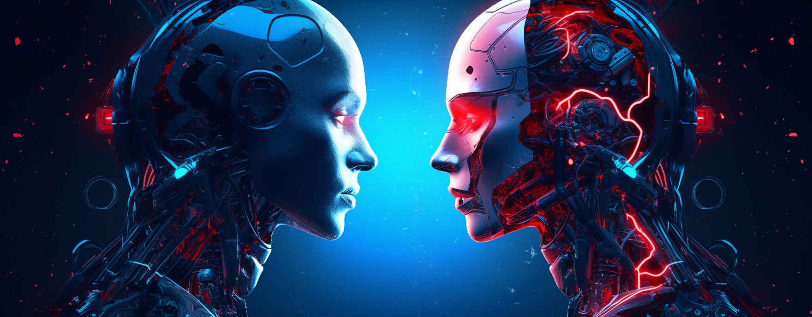

# InsightCrafter™

_Crafting Clarity through Discourse_



## Overview

Delving into the realms of ideation and decision-making, InsightCrafter is an advanced AI tool that assembles a powerful discussion platform aimed at generating diverse and insightful perspectives on crucial subject matters. It introduces a pioneering approach to problem-solving and idea creation, standing as an inspirational keystones in the ProjectCrafter suite of tools.

### Creating Intelligent Discourse: AI Models' Dynamic Interaction

As the centerpiece of this cutting-edge module, two sophisticated AI models engage in an intellectual conversation, each contributing their unique perspectives to the dialogue. The user feeds the AI duo a topic or question of interest, which instigates this interactive exchange. As the sophisticated AIs churn out their ideas, present arguments, and express thoughts, they offer a spectrum of viewpoints on the given subject matter. Thus, InsightCrafter serves as an inspiring brainstorming platform, nurturing a dynamic and potentially transformative discussion.

### User-Guided Exploration: Steering the AI Conversation

The heart of InsightCrafter's uniqueness lies in its capacity to place human users at the helm, grooming them into skilled moderators of this AI-driven dialogue. This aspect enables the end-user to steer the discourse according to their needs, ensuring that the AI conversation remains relevant and fruitful. The human element ensures that while the AI may come up with its insights, the discourse is ultimately anchored in human objectives.

### Powerful Applications: Diversity in Decision-Making and Ideation

InsightCrafter’s utility spans across various domains. From business strategizing to project planning, or from creative storytelling to educational exploration, its applications are virtually limitless. As a potent 'ideo-hub,' InsightCrafter stimulates thought and fosters decision-making, making it a mighty instrument for any intellectual or creative pursuit.

### The Eureka Moment: InsightCrafter’s Ultimate Offering

At the heart of InsightCrafter's myriad features lies its ultimate offering - insights. Just as a diamond cutter shapes raw gems into radiant jewels, InsightCrafter manifests an arena of raw ideas, stimulating them into polished insights. This reverence for the 'fruit' of the module signifies its critical role as an 'idea breeder,' underlining InsightCrafter’s role in paving the path to enlightened decisions.

### Summary

In essence, InsightCrafter presents a paradigm shift in how we ideate, explore, and decide. It amplifies the power of the ProjectCrafter suite by inducing a human-guided AI forum for catalyzing ideas, fostering creativity, and empowering incisive, wisdom-backed judgements.

## Setup

### Configuration

Create a copy of `.env.template` named `.env` and fill in the required values (e.g., `OPENAI_API_KEY`).

### Dependencies

Create and activate a fresh Python virtual environment, then run:

```bash
pip install -r requirements.txt
```

### Running

Start the [streamlit](https://streamlit.io/) auto-reload server:

```bash
streamlit run app.py
```
