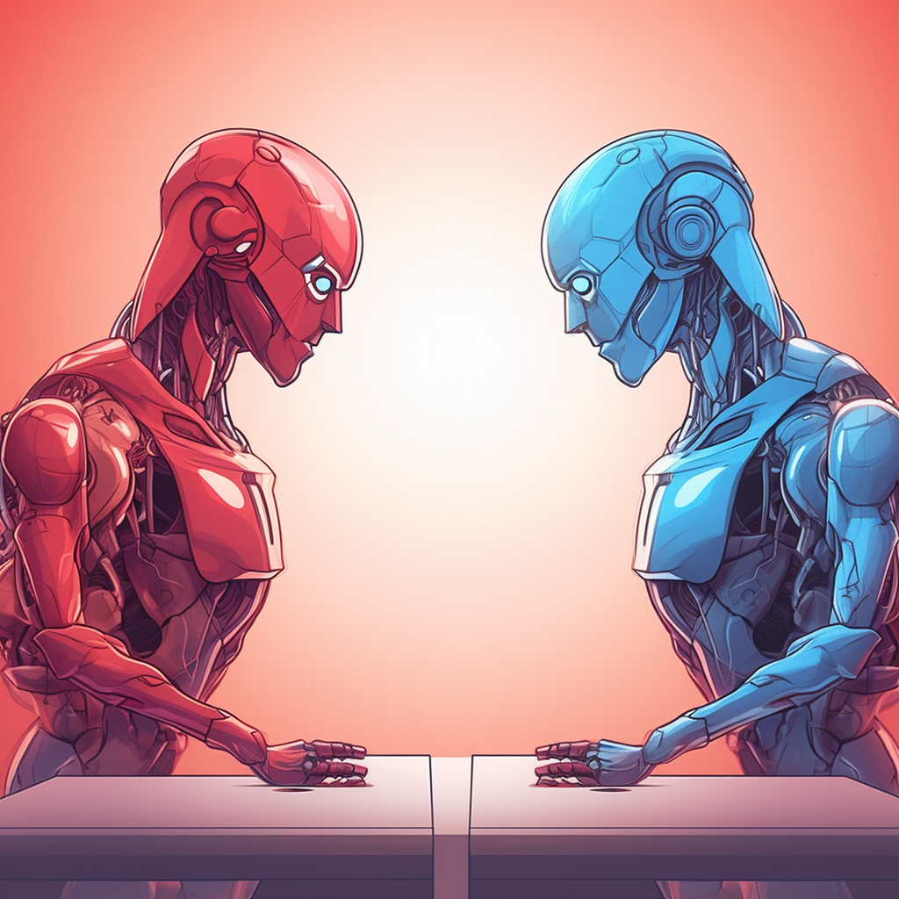

# Red v Blue



Why chat with one GPT when you can chat with two? Or, better yet, have them chat with each other with you as the moderator?

That's the idea behind Red v Blue. It's a chat app that uses two large language models to chat with each other, but you stay in control of the conversation.

Set up a conversation between two AIs, each with their own directives, then seed the conversation with a starting prompt (as one of them), then generate the response from the other. You have a chance to edit that response before sending it back to the first AI, and so on.

```bash
streamlit run app.py
```
